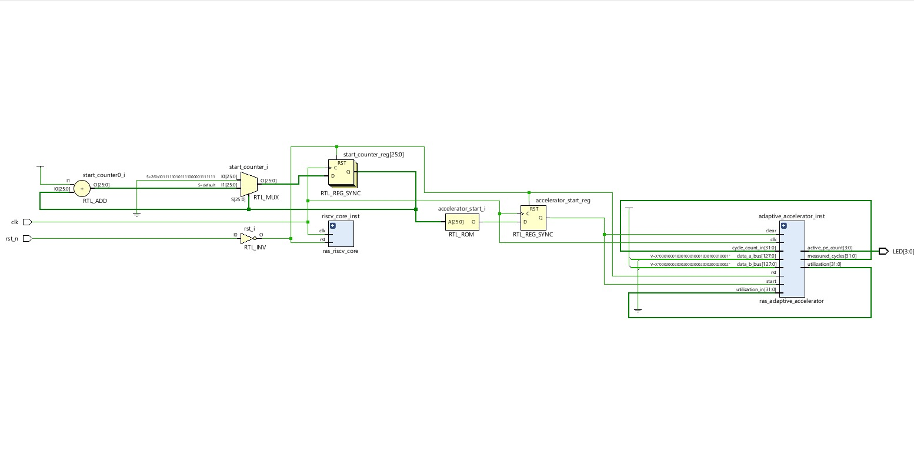
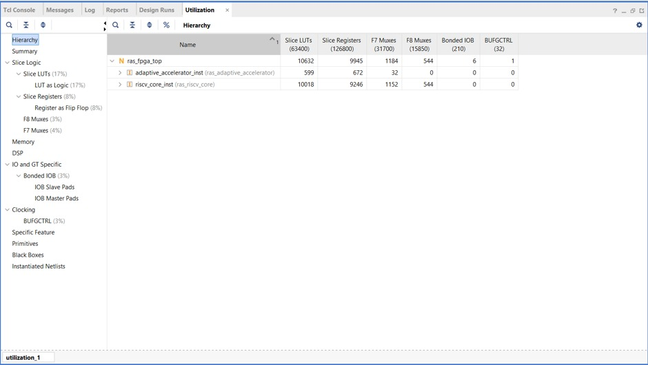
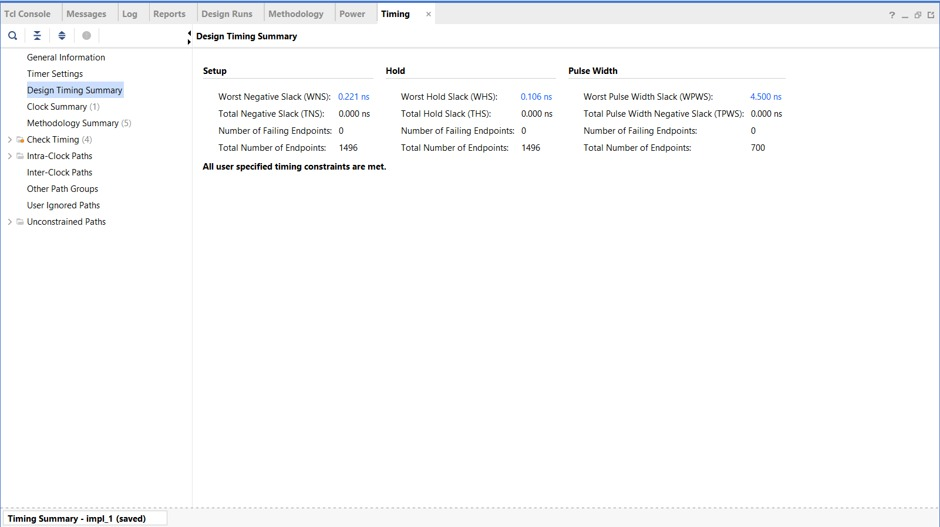
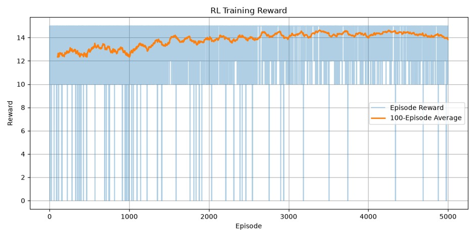
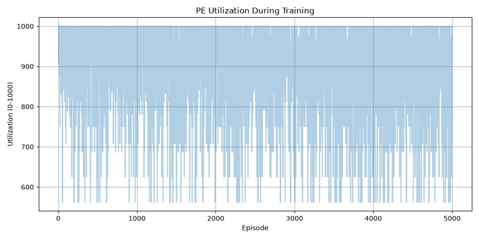
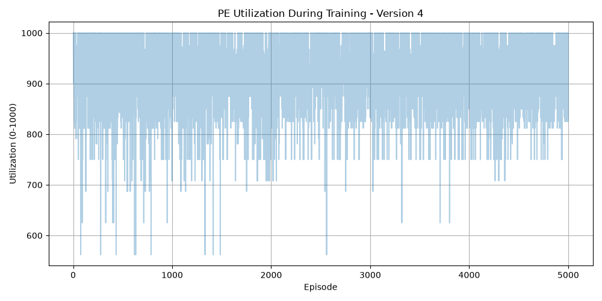
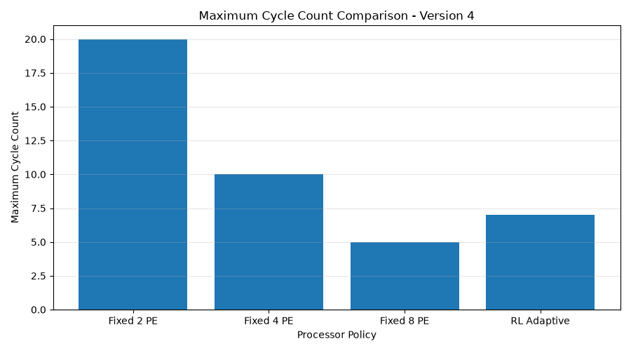
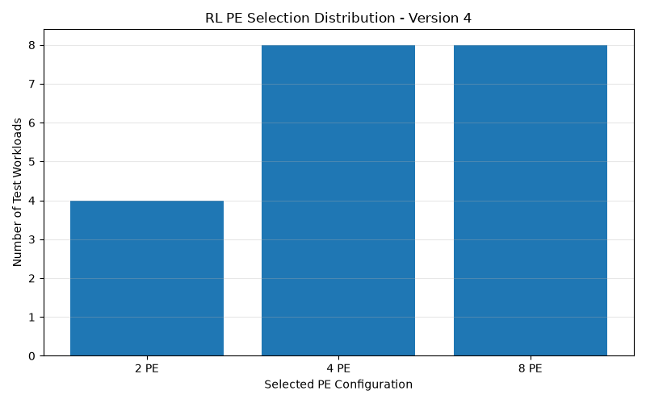

# RL-Adaptive RISC-V AI SoC

> SystemVerilog-Based FPGA Implementation of an Adaptive RV32I RISC-V SoC with Reinforcement Learning-Driven Hardware Optimization

<p align="left">
  
  
  
  
  
</p>

---

## Overview

**RL-Adaptive RISC-V AI SoC** is a **SystemVerilog-based FPGA implementation** of an adaptive AI-enabled RISC-V System-on-Chip that combines an **RV32I processor**, a **Reinforcement Learning controller**, and an **adaptive accelerator** capable of dynamically optimizing hardware behavior based on workload characteristics.

The project demonstrates how reinforcement learning techniques can be integrated directly into hardware architecture to improve accelerator utilization, execution efficiency, and adaptive decision-making.

---

## Project Impact

- Designed a complete **RV32I RISC-V System-on-Chip** with adaptive hardware control.
- Integrated a **Q-Learning controller** directly into SystemVerilog RTL.
- Developed an adaptive accelerator supporting **2 PE, 4 PE, and 8 PE configurations**.
- Successfully synthesized and implemented the complete design using **Xilinx Vivado**.
- Achieved **timing closure with 0 failing endpoints**.
- Evaluated adaptive behavior across **5,000 reinforcement learning training episodes**.
- Demonstrated workload-aware **dynamic PE resource allocation** using reinforcement learning.

---

## Quick Results

| Metric | Result |
|--------|-------:|
| RL Training | **5,000 Episodes** |
| LUT Utilization | **622 / 63,400 (0.98%)** |
| Flip-Flop Utilization | **729 / 126,800 (0.57%)** |
| I/O Utilization | **6 / 210 (2.86%)** |
| Worst Negative Slack | **+0.145 ns** |
| Total Negative Slack | **0 ns** |
| Worst Hold Slack | **+0.095 ns** |
| Total Hold Slack | **0 ns** |
| Adaptive PE Modes | **2, 4, and 8 PE** |

---

## Table of Contents

- [Overview](#overview)
- [Project Impact](#project-impact)
- [Quick Results](#quick-results)
- [Key Features](#key-features)
- [System Architecture](#system-architecture)
- [Project Structure](#project-structure)
- [RTL Modules](#rtl-modules)
- [IP Core Packaging](#ip-core-packaging)
- [Verification](#verification)
- [Simulation Results](#simulation-results)
- [FPGA Implementation Results](#fpga-implementation-results)
- [Reinforcement Learning Performance](#reinforcement-learning-performance)
- [Technology Stack](#technology-stack)
- [Future Improvements](#future-improvements)
- [Author](#author)
- [License](#license)

---

## Key Features

- RV32I RISC-V Processor Core
- Reinforcement Learning Controller
- Q-Learning Adaptation Logic
- Adaptive AI Accelerator
- Processing Element (PE) Array
- Performance Monitoring Unit
- Modular SystemVerilog Design
- Comprehensive Verification Testbenches
- FPGA Implementation using Xilinx Vivado

---

## System Architecture

The SoC integrates a traditional **RV32I processor** with a **Reinforcement Learning-based adaptive hardware subsystem**.

<p align="center">
  
</p>

*Figure 1. RL-Adaptive RISC-V AI SoC architecture.*

### Major Components

| Component | Purpose |
|-----------|---------|
| RV32I Core | Instruction execution |
| RL Controller | Adaptive decision making |
| Q-Learning Engine | Policy updates |
| Adaptive Accelerator | AI workload acceleration |
| PE Array | Parallel computation |
| Performance Monitor | Runtime statistics |

---

## Project Structure

```text
RL-Adaptive-RISCV-AI-SoC/
│
├── images/
│   ├── rtl_architecture.png
│   ├── simulation_waveform.png
│   ├── resource_utilization.png
│   ├── timing_summary.png
│   ├── rl_training_reward.png
│   ├── processor_cycle_count.png
│   ├── pe_utilization_training.png
│   ├── rl_pe_selection.png
│   ├── avg_cycle_comparison.png
│   ├── max_cycle_comparison.png
│   └── pe_selection_distribution.png
│
├── RL_Adaptive_RISCV_AI_SoC.srcs/
│   ├── sources_1/
│   ├── sim_1/
│   └── constrs_1/
│
├── Python/
├── Results/
├── README.md
├── LICENSE
└── .gitignore
```

---

## RTL Modules

| Module | Function |
|--------|----------|
| `ras_riscv_core.sv` | RV32I Processor |
| `ras_control_unit.sv` | Instruction control |
| `ras_instruction_decoder.sv` | Instruction decoding |
| `ras_register_file.sv` | Register storage |
| `ras_alu.sv` | Arithmetic Logic Unit |
| `ras_program_counter.sv` | Program sequencing |
| `ras_q_learning_controller.sv` | Q-learning controller |
| `ras_rl_controller.sv` | Reinforcement learning logic |
| `ras_adaptive_accelerator.sv` | Adaptive AI accelerator |
| `ras_pe_array_controller.sv` | Processing element management |
| `ras_performance_monitor.sv` | Performance monitoring |

---

## IP Core Packaging

The RL-Adaptive RISC-V AI SoC was packaged as a **custom Vivado IP**, enabling the complete adaptive SoC architecture to be reused and integrated into larger FPGA designs through the **Vivado IP Catalog**.

### IP Core Highlights

- Custom Vivado IP packaging
- Reusable SystemVerilog RTL modules
- Modular top-level integration
- Compatible with Xilinx Vivado IP Catalog
- Simplified integration into larger FPGA systems

### IP Core Components

| Component | Purpose |
|----------|---------|
| RV32I Core | Scalar instruction execution |
| RL Controller | Adaptive hardware decision making |
| Q-Learning Engine | Policy update logic |
| Adaptive Accelerator | Workload-aware acceleration |
| PE Array Controller | Dynamic Processing Element allocation |
| Performance Monitor | Runtime performance monitoring |

### Vivado IP Packaging Flow

1. Develop and verify RTL modules.
2. Integrate the complete SoC design.
3. Validate functionality through behavioral simulation.
4. Run synthesis in Xilinx Vivado.
5. Package the design using the **Vivado IP Packager**.
6. Add the packaged IP to the **Vivado IP Catalog**.
7. Instantiate the IP in larger FPGA systems.

### IP Integration Workflow

```text
RTL Design
    │
    ▼
Behavioral Simulation
    │
    ▼
Logic Synthesis
    │
    ▼
Vivado IP Packager
    │
    ▼
Vivado IP Catalog
    │
    ▼
FPGA System Integration
```

---

## Verification

The project includes extensive **SystemVerilog verification** for both individual modules and integrated system behavior.

### Verified Modules

- ALU
- Register File
- Instruction Decoder
- Instruction Memory
- Program Counter
- Processing Element
- PE Array
- RL Controller
- Q-Learning Controller
- Adaptive Accelerator
- Integrated Stress Testing

---

## Simulation Results

Behavioral simulation was performed in **Xilinx Vivado** to verify processor execution, accelerator activation, and reinforcement learning adaptation.

<p align="center">
  
</p>

*Figure 2. Behavioral simulation validating processor execution and adaptive accelerator behavior.*

### Simulation verifies

- Processor execution flow
- Accelerator activation
- RL-based adaptation
- Memory interaction
- Control signal correctness

---

## FPGA Implementation Results

The complete design was synthesized and implemented in **Xilinx Vivado**.

| Resource | Utilization |
|----------|------------:|
| LUT | **622 / 63,400 (0.98%)** |
| Flip-Flop | **729 / 126,800 (0.57%)** |
| Bonded IOB | **6 / 210 (2.86%)** |
| BUFGCTRL | **1 / 32 (3.13%)** |
| F7 Muxes | **1,184** |
| F8 Muxes | **544** |
| Bonded IOB | **6** |
| BUFGCTRL | **1** |

<p align="center">
  
</p>

*Figure 3. FPGA resource utilization after implementation.*

The implementation utilizes approximately **0.98%** of available LUT resources and **0.57%** of available flip-flops while maintaining an efficient register and routing footprint.

### Timing Performance

All specified timing constraints were successfully met.

| Metric | Result |
|--------|-------:|
| Worst Negative Slack (WNS) | **+0.145 ns** |
| Total Negative Slack (TNS) | **0 ns** |
| Worst Hold Slack (WHS) | **+0.095 ns** |
| Total Hold Slack (THS) | **0 ns** |
| Hold Violations | **0** |
| Failing Endpoints | **0** |

<p align="center">
  
</p>

*Figure 4. Vivado timing summary confirming successful timing closure.*

---

## Reinforcement Learning Performance

The reinforcement learning subsystem was evaluated using **5,000 training episodes** to observe convergence behavior, dynamic Processing Element allocation, and processor adaptation.

### Training Reward

<p align="center">
  
</p>

*Figure 5. Moving-average reward across 5,000 training episodes.*

**Observations**

- Stable reward convergence
- Reduced reward variance
- Improved policy consistency
- Long-duration Q-learning training

---

### Processor Cycle Count

<p align="center">
  
</p>

*Figure 6. Processor cycle count adaptation during training.*

The decreasing cycle-count variability indicates increasingly efficient workload scheduling as the RL controller learns improved policies.

---

### Processing Element Utilization

<p align="center">
  
</p>

*Figure 7. Dynamic Processing Element utilization.*

**Key Insights**

- Utilization ranges approximately between **560–1000 active units**
- High sustained accelerator engagement
- Dynamic hardware resource allocation
- Efficient adaptive scheduling

---

### Dynamic PE Selection

<p align="center">
  
</p>

*Figure 8. RL-driven Processing Element selection.*

The controller dynamically selects between **2 PE**, **4 PE**, and **8 PE** configurations depending on workload characteristics.

---

### Average Cycle Count Comparison

<p align="center">
  
</p>

| Configuration | Average Cycle Count |
|--------------|--------------------:|
| Fixed 2 PE | **12.3** |
| Fixed 4 PE | **6.4** |
| Fixed 8 PE | **3.5** |
| RL Adaptive | **4.7** |

The RL controller substantially reduces execution latency compared with smaller fixed configurations while dynamically balancing hardware resources.

---

### Maximum Cycle Count Comparison

<p align="center">
  
</p>

| Configuration | Maximum Cycle Count |
|--------------|--------------------:|
| Fixed 2 PE | **20** |
| Fixed 4 PE | **10** |
| Fixed 8 PE | **5** |
| RL Adaptive | **7** |

The adaptive controller maintains lower worst-case execution behavior than smaller fixed PE configurations.

---

### PE Selection Distribution

<p align="center">
  
</p>

| Selected PE | Test Workloads |
|------------|---------------:|
| 2 PE | **4** |
| 4 PE | **8** |
| 8 PE | **8** |

The learned policy favors larger PE configurations for higher-performance workloads while still selecting smaller configurations when appropriate.

---

## Technology Stack

| Category | Technology |
|----------|------------|
| HDL | SystemVerilog |
| Architecture | RV32I RISC-V |
| FPGA Tool | Xilinx Vivado |
| Verification | SystemVerilog Testbenches |
| AI Technique | Q-Learning |
| Hardware Target | FPGA |

---

## Future Improvements

- Artix-7 hardware deployment
- Multi-core adaptive architecture
- Advanced RL policies
- Dynamic voltage and frequency scaling
- Power-aware scheduling
- Larger Processing Element arrays

---

## Author

**Akshaj Gandi**

Electronics and Communication Engineering

SRM Institute of Science and Technology, Tiruchirappalli

GitHub: **akshajsaigandi-ux**

---

## License

This project is released under the **MIT License**. See the `LICENSE` file for details.

---

## Support

If you found this project useful, consider giving the repository a ⭐.
